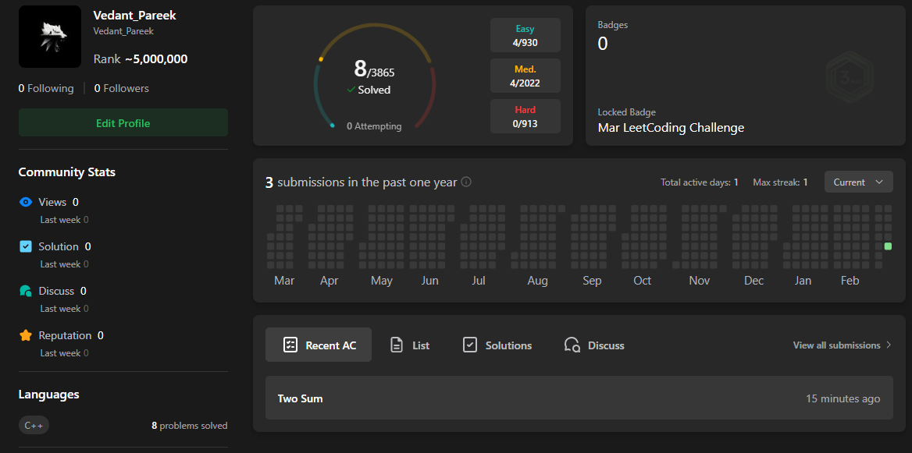
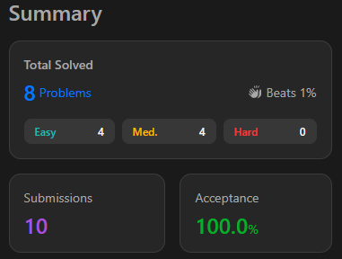

# 🚀 75 Days LeetCode Challenge

<div align="center">


</div>

---

## 👤 LeetCode Profile

<div align="center">



<br/><br/>



</div>

---

## 📌 About

A **75-day coding challenge** where I solve one LeetCode problem every day using **C++**.
The goal is to strengthen problem-solving skills, improve algorithmic thinking, and build consistency.

- 👤 **LeetCode Profile:** [Vedant_Pareek](https://leetcode.com/u/Vedant_Pareek/)
- 💻 **GitHub Repo:** [75DaysLeetCodeChallange](https://github.com/Vode-Coder/75DaysLeetCodeChallange)
- 🗓️ **Start Date:** 12 / Mar / 2026
- 🏁 **End Date:** 25 / May / 2026

---

## 📈 Stats

| Category | Count |
|----------|-------|
| ✅ Solved | 17 / 75 |
| 🟢 Easy | 9 |
| 🟡 Medium | 8 |
| 🔴 Hard | 0 |

---

## 📊 Progress Tracker

| # | Day | Problem No. | Problem Title | Difficulty | Topic | Solution |
|---|-----|-------------|---------------|------------|-------|----------|
| 1 | Day 1 | 1 | Two Sum | 🟢 Easy | Array | [Solution](0001-two-sum/0001-two-sum.cpp) |
| 2 | Day 2 | 217 | Duplicate | 🟢 Easy | Array | [Solution](0217-contains-duplicate/0217-contains-duplicate.cpp)  |
| 3 | Day 3 | 242 | Vaild Anagram | 🟢 Easy | hash | [Solution](0242-valid-anagram/0242-valid-anagram.cpp) |
| 4 | Day 4 | 448 | Number Disappered in array | 🟢 Easy | Array | [Solution](0448-find-all-numbers-disappeared-in-an-array/0448-find-all-numbers-disappeared-in-an-array.cpp) |
| 5 | Day 5 | 49 | Group Anagrams | 🟡 Medium | Array | [Solution](0049-group-anagrams/0049-group-anagrams.cpp) |
| 6 | Day 6 | 347 | Top K frequency | 🟡 Medium | Heap | [Solution](0347-top-k-frequent-elements/0347-top-k-frequent-elements.cpp) |
| 7 | Day 7 | 238 | Product of Array Except Self | 🟡 Medium | Array | [Solution](0238-product-of-array-except-self/0238-product-of-array-except-self.cpp) |
| 8 | Day 8 | 125 | Valid palindrome | 🟢 Easy | String | [Solution](/0125-valid-palindrome//0125-valid-palindrome.cpp) |
| 9 | Day 9 | 26 | Remove Duplicates From Sorted Array | 🟢 Easy | Array | [Solution](/0026-remove-duplicates-from-sorted-array//0026-remove-duplicates-from-sorted-array.cpp) |
| 10 | Day 10 | 283 | Move Zeros | 🟢 Easy | Array | [Solution](/0283-move-zeroes//0283-move-zeroes.cpp) |
| 11 | Day 11 | 167 | Two Sums | 🟡 Medium | Array | [Solution](/0167-two-sum-ii-input-array-is-sorted//0167-two-sum-ii-input-array-is-sorted.cpp) |
| 12 | Day 12 | 15 | Three Sum | 🟡 Medium | Array | [Solution](/0015-3sum//0015-3sum.cpp) |
| 13 | Day 13 | 11 | Container with Most Water | 🟡 Medium | Array,Greedy | [Solution](/0011-container-with-most-water//0011-container-with-most-water.cpp) |
| 14 | Day 14 | 121 | Best Time to Buy and Sell Stock | 🟢 Easy | Array | [Solution](/0121-best-time-to-buy-and-sell-stock//0121-best-time-to-buy-and-sell-stock.cpp) |
| 15 | Day 15 | 643 | Maximun Average Subarray 1 | 🟢 Easy | Array | [Solution](/0643-maximum-average-subarray-i//0643-maximum-average-subarray-i.cpp) |
| 16 | Day 16 | 3 | Longest Substring Without Repeating Characters | 🟡 Medium | Hash | [Solution](/0003-longest-substring-without-repeating-characters//0003-longest-substring-without-repeating-characters.cpp) |
| 17 | Day 17 | 424 | Longest Repeating Character Replacement | 🟡 Medium | Hash | [Solution](/0424-longest-repeating-character-replacement//0424-longest-repeating-character-replacement.cpp) |
| 18 | Day 18 | - | - | - | - | - |
| 19 | Day 19 | - | - | - | - | - |
| 20 | Day 20 | - | - | - | - | - |
| 21 | Day 21 | - | - | - | - | - |
| 22 | Day 22 | - | - | - | - | - |
| 23 | Day 23 | - | - | - | - | - |
| 24 | Day 24 | - | - | - | - | - |
| 25 | Day 25 | - | - | - | - | - |
| 26 | Day 26 | - | - | - | - | - |
| 27 | Day 27 | - | - | - | - | - |
| 28 | Day 28 | - | - | - | - | - |
| 29 | Day 29 | - | - | - | - | - |
| 30 | Day 30 | - | - | - | - | - |
| 31 | Day 31 | - | - | - | - | - |
| 32 | Day 32 | - | - | - | - | - |
| 33 | Day 33 | - | - | - | - | - |
| 34 | Day 34 | - | - | - | - | - |
| 35 | Day 35 | - | - | - | - | - |
| 36 | Day 36 | - | - | - | - | - |
| 37 | Day 37 | - | - | - | - | - |
| 38 | Day 38 | - | - | - | - | - |
| 39 | Day 39 | - | - | - | - | - |
| 40 | Day 40 | - | - | - | - | - |
| 41 | Day 41 | - | - | - | - | - |
| 42 | Day 42 | - | - | - | - | - |
| 43 | Day 43 | - | - | - | - | - |
| 44 | Day 44 | - | - | - | - | - |
| 45 | Day 45 | - | - | - | - | - |
| 46 | Day 46 | - | - | - | - | - |
| 47 | Day 47 | - | - | - | - | - |
| 48 | Day 48 | - | - | - | - | - |
| 49 | Day 49 | - | - | - | - | - |
| 50 | Day 50 | - | - | - | - | - |
| 51 | Day 51 | - | - | - | - | - |
| 52 | Day 52 | - | - | - | - | - |
| 53 | Day 53 | - | - | - | - | - |
| 54 | Day 54 | - | - | - | - | - |
| 55 | Day 55 | - | - | - | - | - |
| 56 | Day 56 | - | - | - | - | - |
| 57 | Day 57 | - | - | - | - | - |
| 58 | Day 58 | - | - | - | - | - |
| 59 | Day 59 | - | - | - | - | - |
| 60 | Day 60 | - | - | - | - | - |
| 61 | Day 61 | - | - | - | - | - |
| 62 | Day 62 | - | - | - | - | - |
| 63 | Day 63 | - | - | - | - | - |
| 64 | Day 64 | - | - | - | - | - |
| 65 | Day 65 | - | - | - | - | - |
| 66 | Day 66 | - | - | - | - | - |
| 67 | Day 67 | - | - | - | - | - |
| 68 | Day 68 | - | - | - | - | - |
| 69 | Day 69 | - | - | - | - | - |
| 70 | Day 70 | - | - | - | - | - |
| 71 | Day 71 | - | - | - | - | - |
| 72 | Day 72 | - | - | - | - | - |
| 73 | Day 73 | - | - | - | - | - |
| 74 | Day 74 | - | - | - | - | - |
| 75 | Day 75 | - | - | - | - | - |

> **Difficulty Legend:** 🟢 Easy &nbsp;|&nbsp; 🟡 Medium &nbsp;|&nbsp; 🔴 Hard

---

## 📁 Folder Structure

```
75DaysLeetCodeChallange/
│
├── Day01/
│   └── solution.cpp
├── Day02/
│   └── solution.cpp
├── ...
└── README.md
```

---

## 🛠️ How to Run

```bash
# Clone the repository
git clone https://github.com/Vode-Coder/75DaysLeetCodeChallange.git

# Navigate to a day's folder
cd Day01

# Compile using g++
g++ -o solution solution.cpp

# Run
./solution
```

---

---

## 🔗 Connect

- 🧑‍💻 LeetCode: [Vedant_Pareek](https://leetcode.com/u/Vedant_Pareek/)
- 🐙 GitHub: [Vode-Coder](https://github.com/Vode-Coder)

---

<div align="center">
  <i>Consistency is the key to mastery. One problem at a time. 💪</i>
</div>

<!---LeetCode Topics Start-->
# LeetCode Topics
## Array
|  |
| ------- |
| [0011-container-with-most-water](https://github.com/Vode-Coder/75DaysLeetCodeChallange/tree/master/0011-container-with-most-water) |
| [0015-3sum](https://github.com/Vode-Coder/75DaysLeetCodeChallange/tree/master/0015-3sum) |
| [0026-remove-duplicates-from-sorted-array](https://github.com/Vode-Coder/75DaysLeetCodeChallange/tree/master/0026-remove-duplicates-from-sorted-array) |
| [0049-group-anagrams](https://github.com/Vode-Coder/75DaysLeetCodeChallange/tree/master/0049-group-anagrams) |
| [0121-best-time-to-buy-and-sell-stock](https://github.com/Vode-Coder/75DaysLeetCodeChallange/tree/master/0121-best-time-to-buy-and-sell-stock) |
| [0167-two-sum-ii-input-array-is-sorted](https://github.com/Vode-Coder/75DaysLeetCodeChallange/tree/master/0167-two-sum-ii-input-array-is-sorted) |
| [0217-contains-duplicate](https://github.com/Vode-Coder/75DaysLeetCodeChallange/tree/master/0217-contains-duplicate) |
| [0238-product-of-array-except-self](https://github.com/Vode-Coder/75DaysLeetCodeChallange/tree/master/0238-product-of-array-except-self) |
| [0283-move-zeroes](https://github.com/Vode-Coder/75DaysLeetCodeChallange/tree/master/0283-move-zeroes) |
| [0347-top-k-frequent-elements](https://github.com/Vode-Coder/75DaysLeetCodeChallange/tree/master/0347-top-k-frequent-elements) |
| [0448-find-all-numbers-disappeared-in-an-array](https://github.com/Vode-Coder/75DaysLeetCodeChallange/tree/master/0448-find-all-numbers-disappeared-in-an-array) |
| [0643-maximum-average-subarray-i](https://github.com/Vode-Coder/75DaysLeetCodeChallange/tree/master/0643-maximum-average-subarray-i) |
## Hash Table
|  |
| ------- |
| [0003-longest-substring-without-repeating-characters](https://github.com/Vode-Coder/75DaysLeetCodeChallange/tree/master/0003-longest-substring-without-repeating-characters) |
| [0049-group-anagrams](https://github.com/Vode-Coder/75DaysLeetCodeChallange/tree/master/0049-group-anagrams) |
| [0217-contains-duplicate](https://github.com/Vode-Coder/75DaysLeetCodeChallange/tree/master/0217-contains-duplicate) |
| [0242-valid-anagram](https://github.com/Vode-Coder/75DaysLeetCodeChallange/tree/master/0242-valid-anagram) |
| [0347-top-k-frequent-elements](https://github.com/Vode-Coder/75DaysLeetCodeChallange/tree/master/0347-top-k-frequent-elements) |
| [0424-longest-repeating-character-replacement](https://github.com/Vode-Coder/75DaysLeetCodeChallange/tree/master/0424-longest-repeating-character-replacement) |
| [0448-find-all-numbers-disappeared-in-an-array](https://github.com/Vode-Coder/75DaysLeetCodeChallange/tree/master/0448-find-all-numbers-disappeared-in-an-array) |
## Sorting
|  |
| ------- |
| [0015-3sum](https://github.com/Vode-Coder/75DaysLeetCodeChallange/tree/master/0015-3sum) |
| [0049-group-anagrams](https://github.com/Vode-Coder/75DaysLeetCodeChallange/tree/master/0049-group-anagrams) |
| [0217-contains-duplicate](https://github.com/Vode-Coder/75DaysLeetCodeChallange/tree/master/0217-contains-duplicate) |
| [0242-valid-anagram](https://github.com/Vode-Coder/75DaysLeetCodeChallange/tree/master/0242-valid-anagram) |
| [0347-top-k-frequent-elements](https://github.com/Vode-Coder/75DaysLeetCodeChallange/tree/master/0347-top-k-frequent-elements) |
## String
|  |
| ------- |
| [0003-longest-substring-without-repeating-characters](https://github.com/Vode-Coder/75DaysLeetCodeChallange/tree/master/0003-longest-substring-without-repeating-characters) |
| [0049-group-anagrams](https://github.com/Vode-Coder/75DaysLeetCodeChallange/tree/master/0049-group-anagrams) |
| [0125-valid-palindrome](https://github.com/Vode-Coder/75DaysLeetCodeChallange/tree/master/0125-valid-palindrome) |
| [0242-valid-anagram](https://github.com/Vode-Coder/75DaysLeetCodeChallange/tree/master/0242-valid-anagram) |
| [0424-longest-repeating-character-replacement](https://github.com/Vode-Coder/75DaysLeetCodeChallange/tree/master/0424-longest-repeating-character-replacement) |
## Divide and Conquer
|  |
| ------- |
| [0347-top-k-frequent-elements](https://github.com/Vode-Coder/75DaysLeetCodeChallange/tree/master/0347-top-k-frequent-elements) |
## Heap (Priority Queue)
|  |
| ------- |
| [0347-top-k-frequent-elements](https://github.com/Vode-Coder/75DaysLeetCodeChallange/tree/master/0347-top-k-frequent-elements) |
## Bucket Sort
|  |
| ------- |
| [0347-top-k-frequent-elements](https://github.com/Vode-Coder/75DaysLeetCodeChallange/tree/master/0347-top-k-frequent-elements) |
## Counting
|  |
| ------- |
| [0347-top-k-frequent-elements](https://github.com/Vode-Coder/75DaysLeetCodeChallange/tree/master/0347-top-k-frequent-elements) |
## Quickselect
|  |
| ------- |
| [0347-top-k-frequent-elements](https://github.com/Vode-Coder/75DaysLeetCodeChallange/tree/master/0347-top-k-frequent-elements) |
## Prefix Sum
|  |
| ------- |
| [0238-product-of-array-except-self](https://github.com/Vode-Coder/75DaysLeetCodeChallange/tree/master/0238-product-of-array-except-self) |
## Two Pointers
|  |
| ------- |
| [0011-container-with-most-water](https://github.com/Vode-Coder/75DaysLeetCodeChallange/tree/master/0011-container-with-most-water) |
| [0015-3sum](https://github.com/Vode-Coder/75DaysLeetCodeChallange/tree/master/0015-3sum) |
| [0026-remove-duplicates-from-sorted-array](https://github.com/Vode-Coder/75DaysLeetCodeChallange/tree/master/0026-remove-duplicates-from-sorted-array) |
| [0125-valid-palindrome](https://github.com/Vode-Coder/75DaysLeetCodeChallange/tree/master/0125-valid-palindrome) |
| [0167-two-sum-ii-input-array-is-sorted](https://github.com/Vode-Coder/75DaysLeetCodeChallange/tree/master/0167-two-sum-ii-input-array-is-sorted) |
| [0283-move-zeroes](https://github.com/Vode-Coder/75DaysLeetCodeChallange/tree/master/0283-move-zeroes) |
## Binary Search
|  |
| ------- |
| [0167-two-sum-ii-input-array-is-sorted](https://github.com/Vode-Coder/75DaysLeetCodeChallange/tree/master/0167-two-sum-ii-input-array-is-sorted) |
## Greedy
|  |
| ------- |
| [0011-container-with-most-water](https://github.com/Vode-Coder/75DaysLeetCodeChallange/tree/master/0011-container-with-most-water) |
## Dynamic Programming
|  |
| ------- |
| [0121-best-time-to-buy-and-sell-stock](https://github.com/Vode-Coder/75DaysLeetCodeChallange/tree/master/0121-best-time-to-buy-and-sell-stock) |
## Sliding Window
|  |
| ------- |
| [0003-longest-substring-without-repeating-characters](https://github.com/Vode-Coder/75DaysLeetCodeChallange/tree/master/0003-longest-substring-without-repeating-characters) |
| [0424-longest-repeating-character-replacement](https://github.com/Vode-Coder/75DaysLeetCodeChallange/tree/master/0424-longest-repeating-character-replacement) |
| [0643-maximum-average-subarray-i](https://github.com/Vode-Coder/75DaysLeetCodeChallange/tree/master/0643-maximum-average-subarray-i) |
<!---LeetCode Topics End-->
